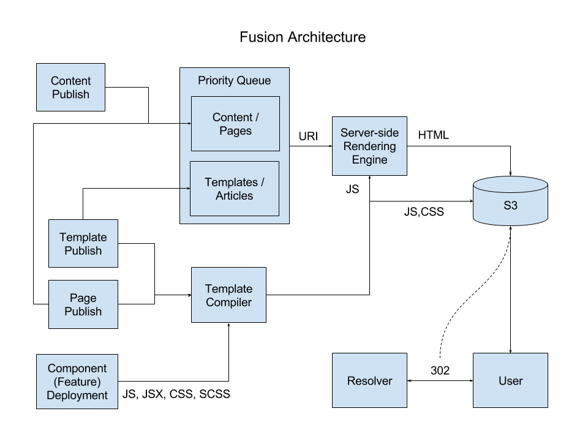

# Fusion
A static, pre-rendered replacement for PageBuilder

## TL;DR

1.  A static resource bucket that hosts the entire site at rest
1.  An offline server-side rendering engine that responds to content pushes and saves them to the static resource bucket
1.  A template compiler that responds to PB admin edits, recompiles atomic javascript template functions, and saves them to the static resource bucket
1.  A client-side rendering engine that re-renders articles after load with the latest template

## Abstract

Fusion is a complete architecture re-design of the PageBuilder system. The existing PageBuilder application performs two primary functions when resolving a request: fetch the latest content relevant to the request, and render that content with the applicable template for the request. Fusion aims to perform the same functionality, but in a less resource-intensive way.

The current implementation is designed to execute on-demand due to the highly fluid nature of templates. If we were to only consider content changes, a push-based pre-rendering model would be more than sufficient and easily scalable as we would only need the server to keep pace with human typing. However, since a single template may be reused for (hundreds of?) thousands of articles, a single template change can lead to a significant volume of rendering jobs. In order to mitigate this volume, renders are only executed as necessary, leading to the on-demand model.

This approach, however, means that a mostly static, read-only website is subject to real-time execution exceptions and latency. Increased load leads to increased latency and a higher risk of making the site inoperable without appropriate auto-scaling. And auto-scaling is often not responsive enough to address volume spikes.

## Approach

Fusion is a collection of the following pieces:
1.  Static Resource Bucket (S3)
1.  Prioritized Rendering Queue
1.  Server-side Pre-rendering Engine
1.  Template Compiler
1.  Template/Content Resolver
1.  Client-side Rendering Engine

### Static Resource Bucket

The primary goal with Fusion is to make a primarily static, read-only website actually static and read-only. To that end, we need a place to store these static resources. We can use any available online storage mechanism, but S3 seems to be an ideal option.

### Push + Prioritized Queue + Pre-rendering

In order to support up-to-date content changes, a server-side pre-rendering engine must be constantly available to re-render anytime a content change is published. This would essentially be an offline version of the current PageBuilder rendering app, but instead of responding to direct user requests, it would work from the prioritized queue to render articles and save them to the resource bucket.

The pre-rendering engine will also re-render articles whose templates have changed, but those will have very low priority and only be executed when all content changes (to include traditional PageBuilder "pages") have been completed.

The queue would also need to be smart enough to prioritize changes to high traffic articles like the homepage.

### Template Compiling

Any time a template is changed, it will need to be re-compiled and pushed into the resource bucket. These changes consist of both redeployment of component (feature) libraries as well as publish events from the PageBuilder admin. In either case, a compilation will result in new atomic javascript files and synchronous css files being generated.

In general, these compilations are extremely fast and - in the worst case - are limited to a few hundred files.

### Template / Content Resolver

Fusion will still require a template and content resolver, just as the existing PageBuilder system does. The proposed approach to template resolution is to request the template javascript file via the resolver with it returning 302 redirects to the static resource files. This approach to not hard-coding the template name in the static HTML will support the changing of resolver rules, but also take advantage of the static resource bucket and shared template caching.

If we choose to implement live update of content, we will need to provide a similar redirect endpoint for content. However, if the priority queue is implemented correctly, content changes may be available soon enough that the pre-rendered values are sufficiently up-to-date.

### Client-side re-rendering

The primary downside to server-side pre-rendering is out-of-date templates. A single template publish can invalidate (hundreds of?) thousands of articles. Server-side pre-rendering cannot be expected to re-render an entire site with a single publish.

In order to mitigate this delay in server-side rendering, the updated template will be loaded into the client browser and used to re-render the article. The browser will initially load and paint the static pre-rendered version of the page, quickly re-rendering to the updated version based on the loaded template file.

## Considerations

### Styles

Styles can be compiled into the template javascript files; however, this leads to two issues. First, any noscript user will see the "craigslist" unstyled version of your article. Second, even script-enabled users will see a "craigslist" flash when the original static HTML is loaded and rendered before the template script is re-rendered with the appropriate styling.

In order to mitigate these issues, scripts will be kept in separate css files.

### Synchronicity / Atomicity

Since templates are pre-compiled into a single javascript file to include all code for all necessary components (features), synchronicity between versions is unnecessary. However, synchronicity between javascript templates and css files will be necessary. To this end, css files will be versioned and named by content hash. This versioned name will be written to the template javascript file on compilation. When an updated template file is used to re-render an article, the reference to its accompanying css file will replace the reference in the static HTML file, causing the article styling to be updated as necessary.

### File Volume

Since template javascript files are atomic and re-compiled on publish, there is no need to keep older versions, so the maximum number of template files stored is equal to the sum of the number of pages and templates in the PageBuilder admin.

Since css files will be versioned, there will be a greater number of them created. However, since the versioning is content based, a new file will be created only when the content has changed (due to a change in the actual styling, or to the components referenced by a template).

### Async Content / Rendering

Asynchronous content and rendering is handled just like any other website, with XMLHttpRequest or fetch and via standard DOM manipulation. Since fusion is react-based, components can be created to handle their own content fetching and re-rendering.

### Component (Feature) Content

The simplest approach to component content is to require it all to be asynchronous. This, however, is not a good model for noscript users. However, since react rendering is a synchronous execution, fetching component content on the server can be problematic.

The solution I have come up with is to perform an optional second rendering on the server. All articles will receive an initial rendering using the provided template and global content appropriate to the article in question. While rendering, any component content requirements will be asynchronously requested and cached. After the first rendering is finished, if the content cache is empty, rendering is complete. If the content cache contains any elements, we wait for them all to return. When the cache is fully populated, we perform a second rendering that instead of requesting component content can just read it from the cache.

Along with using the component content to render the HTML, it is also appended as JSON within a script tag in the resultant HTML. This is because when the article is loaded in the client and re-rendered with the latest template, the component content will be re-fetched, but may not have returned yet. So the first client render uses the provided cache to prevent the pre-rendered component content from being removed from the article. Once the component content fetching returns, the updated content will be rendered into the article.

### Unenumerated Articles

There are certain types of articles that are not enumerated by our content systems, meaning this system will not be aware of them and they cannot be pre-rendered. With the existing PageBuilder system, this is not a problem as all requests are handled on-demand. However, there is no ideal solution to this issue when using a static bucket of resources.

The solution I am proposing is to provide a custom 404 page that wraps its message in a noscript tag. This way, any noscript users will immediately be presented with a 404 page. However, the 404 template will also generate an asynchronous content request. If the content responds appropriately, it will be rendered into the appropriate template and presented to the user as the article. If the content fails to load, it likely does not exist and the 404 message will be moved from inside the noscript tag into the primary body of the document, presenting a script-enabled user with a traditional 404 page after a short delay.

## Comparison

### PageBuilder

#### Pros

1.  Always up-to-date
1.  Supports asynchronous and custom content

#### Cons

1.  On-Demand rendering
    -   Performance and scaling issues
1.  On-demand asset compilation
1.  Fully server-side rendering
    -   Performance and scaling issues
    -   Requires server APIs to provide JSP rendered components
1.  Synchronous Execution (threads get full)
1.  JSP templating
    -   It's 2017
1.  Maintenance Costs
    -   Because JSP isn't a fully-featured templating language, a large portion of PageBuilder development time goes into extending JSP capabilities

### Fusion

#### Pros

1.  Always up-to-date
1.  Supports asynchronous and custom content
1.  Out-of-band server-side pre-rendering
1.  Out-of-band server-side asset compilation
1.  Fully asynchronous design
1.  No on-demand server-side rendering
    -   No execution latency.
    -   No 500 errors. Ever. (unless S3 fails)
1.  React JSX templating
    -   Could likely be modified to support Vue.js or Angular

#### Cons

1.  Noscript users are not guaranteed to get the latest layout
